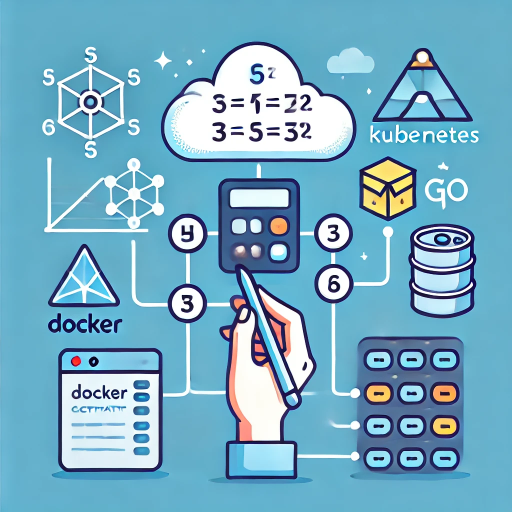

The Mass Calculator application represents a practical implementation of cloud-native technologies, focusing on modern development and deployment practices.

## Overview

This application, built with Go, is designed to calculate the mass of various geometrical shapes, such as aluminum spheres and iron cubes. It exposes a RESTful API for interaction, providing a clean, efficient solution for mathematical computations.

## Key Technologies

| Technology | Description |
|------------|-------------|
| 🐹 **Go** | High-performance language for backend development, offering concurrency and efficient memory management. |
| 🐳 **Docker** | Containerization platform for building, deploying, and running applications in isolated environments. |
| 🚀 **Helm** | Kubernetes package manager that simplifies deployment through reusable charts. |

**Go Programming:**  
The application leverages Go for its efficient concurrency model and powerful standard library, enabling the handling of multiple requests simultaneously. The Go language's lightweight nature ensures minimal overhead, making it ideal for the application's backend logic, where performance is key.

**Docker Containerization:**  
Docker is used to containerize the application, utilizing a multi-stage build process to create a minimal and secure image. This approach reduces the final image size and improves security by only including essential components in the runtime environment.

**Helm Deployment:**  
Helm simplifies the deployment process on Kubernetes by automating the setup of various components, such as services and ingress controllers. The provided Helm chart includes configurations tailored for both development and production environments, offering flexibility and scalability in managing the application's deployment lifecycle.

## Deployment Process

The application supports deployment in both development and production environments. Using Helm, the process is streamlined, with separate YAML configuration files (`values-dev.yaml` and `values-prod.yaml`) to accommodate specific environment needs. In production, the application can be exposed via a LoadBalancer, while in development, a NodePort service type is used.

## Technical Implementation

**API Endpoints:**  
The API includes endpoints for different shapes, with parameters for dimensions. This allows users to calculate mass through a simple HTTP request.

**Health and Readiness Checks:**  
The application includes `/healthz` and `/readyz` endpoints, ensuring smooth operation and integration with Kubernetes health checks.

**Configuration Flexibility:**  
The Helm chart’s flexibility allows for easy customization, with parameters defined in the values files to suit different deployment scenarios.

---

You can find the project repository here: [GitHub - Mass Calculator Helm Chart](https://github.com/socrabytes/mass-calculator-helm-chart)
a