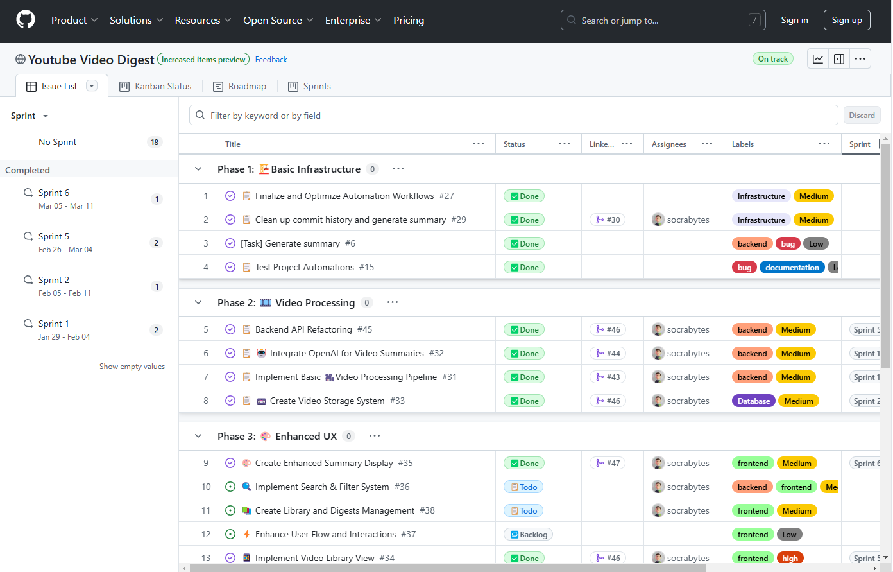


Built with one goal: create a lightweight, scalable system that could adapt and evolve without rewrites.


[YouTube Digest]() isn't just functional.
It’s a system designed for growth, built on async-first patterns, containerization, and modular AI integration.
This article breaks down the key architectural decisions behind it.

---

## 🧱 **Foundations That Scale**


flowchart LR
  A[Next.js UI] --> B[FastAPI API]
  B --> C[PostgreSQL]
  B --> D[Background Workers]
  D --> E[yt-dlp]
  D --> F[OpenAI]
  E --> C
  F --> C
  C --> A
  subgraph Frontend
    A
    end
  subgraph Backend
    B
    D
    E
    F
    end
  subgraph DB
    C
  end


- **Containerized from Day One:** The entire stack runs in Docker Compose—frontend (Next.js), backend (FastAPI), and database (PostgreSQL). That makes it reproducible, portable, and ready for production. A single `docker-compose up` is all it takes to spin up the full environment.
- **Mounted Volumes for Fast Dev:** To move fast, I mapped local volumes to my containers. No rebuild loops—just save and refresh. This cut iteration time drastically during early development and testing.

* * *

## 🔁 **Strategic Tradeoffs, Not Shortcuts**

- **yt-dlp &gt; YouTube API:** I bypassed the YouTube Data API completely. Instead, I use `yt-dlp` to extract metadata and transcripts reliably—no quota limits, no credential headaches. It’s battle-tested (100k+ github ⭐'s) and does exactly what I need.
- **PostgreSQL as Cache + Source of Truth:** Every transcript and summary is stored, so nothing gets recomputed unnecessarily. Avoiding repeated OpenAI calls reduces latency and keeps costs down—critical for scaling responsibly.
- **Async-First, Always:** Heavy lifting (like fetching transcripts or summarizing long videos) happens in background tasks. The frontend stays responsive. If something takes 60 seconds, it won’t block anything else.

* * *

## 📈 **Performance, Observability, and Cost Control**

- **Digest Polling & Status Updates:** The frontend polls the backend to check video and digest processing status, ensuring users always see real-time feedback without blocking the UI.
- **Token Usage & Cost Tracking:** Every OpenAI request logs tokens in/out. Right now it’s just internal, but the groundwork is there for per-user quotas, cost dashboards, or even billing in the future.

| Video ID | Tokens In | Tokens Out | Cost (USD) |
|----------|----------:|-----------:|-----------:|
| abc123   |      1,200|        800|      0.016|
| xyz789   |      2,500|      1,600|      0.032|
| **Total**|      3,700|      2,400|      0.048|

## 🏗️ Built with Intent

Development was structured with long-term maintainability in mind—from backend schema design to the sprint process behind each feature.  
Task planning was managed using [GitHub Projects](https://github.com/users/socrabytes/projects/6/views/7), organized across clearly defined phases: `infrastructure`, `video processing`, and `UX`.

### 🛠️ **Engineered for What's Next**


erDiagram
  users {
    int id PK
    string email
  }
  videos {
    int id PK
    string url
  }
  summaries {
    int id PK
    int video_id FK
    text content
    datetime created_at
  }
  users ||--o{ summaries: "creates"
  videos ||--o{ summaries: "has"


- **Overbuilt Schema (On Purpose):** I designed the database with user accounts, content tracking, and digest history in mind—even though none of it’s visible in the UI yet. No rewrites later—just feature toggles when I need them.
- **Library View (WIP):** Digest persistence is live. You can already retrieve previous summaries. The “library view” isn’t fully polished yet, but the backend is ready for when it is.
- **Model-Agnostic Summarization:** The app started on GPT-4-turbo and now runs `o3-mini`. As new models drop, upgrades are plug-and-play. The MVP is quite literally the worst these summaries will ever be.

* * *

## 🧠 Closing Thoughts

This isn’t just a working prototype—it’s a system designed to grow without crumbling. The early effort was intentional, and it sets the stage for rapid iteration without technical debt. 

With the core foundation resilient and scalable, future work will focus on surface-level improvements: UX enhancements, personalized digest libraries, user dashboards, and streamlined model swapping as newer capabilities emerge.

See how the pieces fit together—or build on it yourself:

  Github Repo 