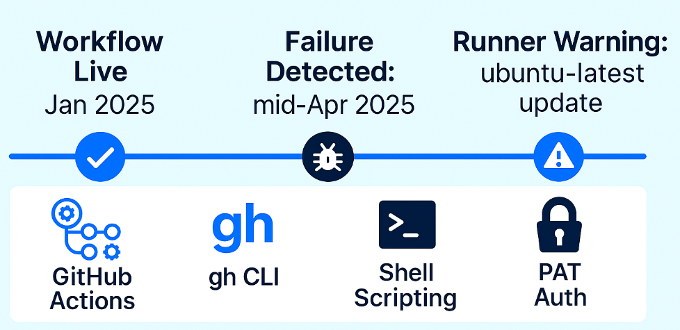
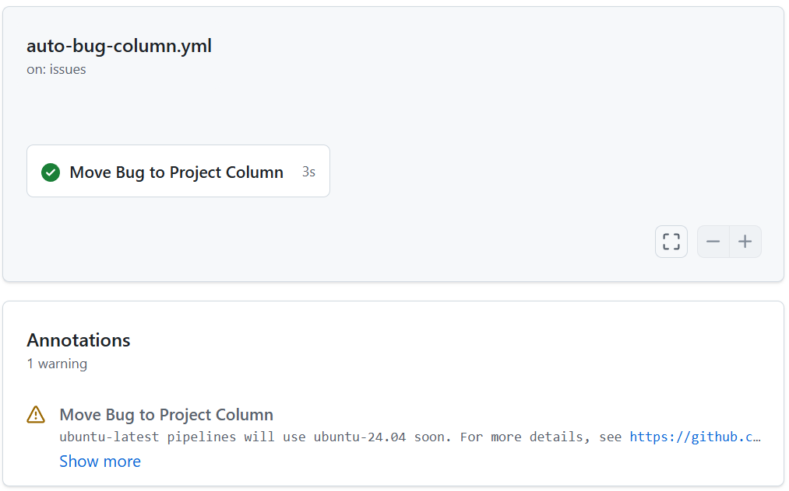
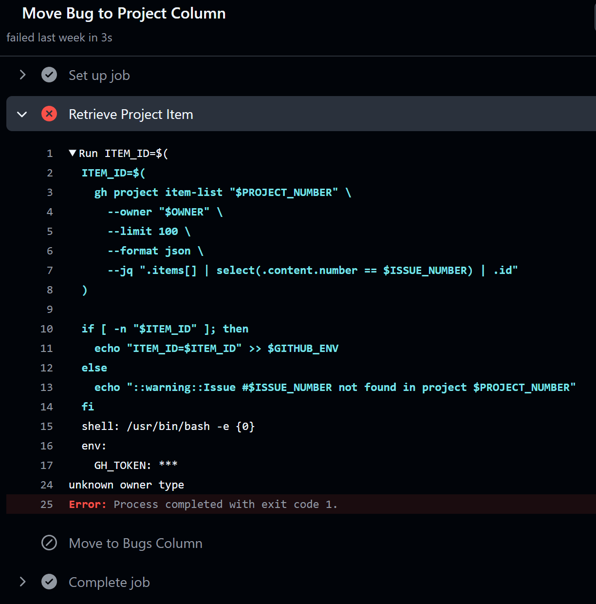
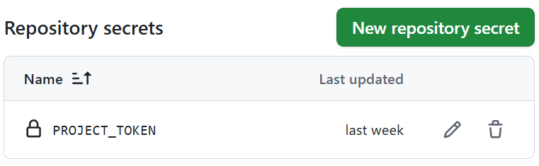
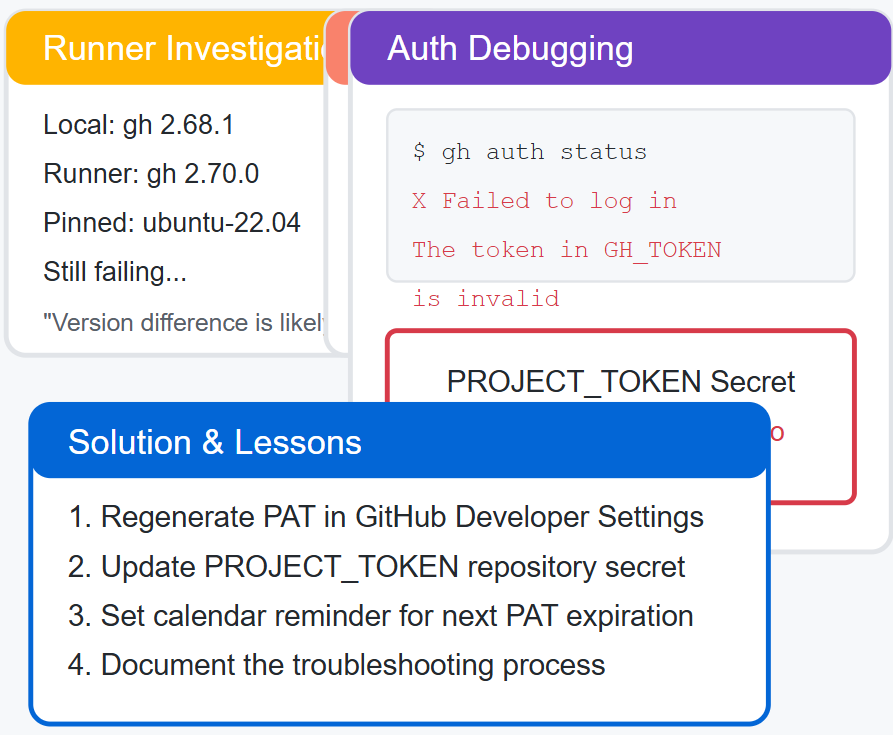

When a _GitHub Actions workflow_ that had been working fine for months suddenly failed, I went down a familiar rabbit hole of false assumptions, vague errors, and misleading logs. This post details the troubleshooting journey, the kind that initially screams ***“runner environment change,”*** but ends in a quiet whisper: ***“your token expired.”***

## Failing Automation That Moved 🐛 Issues

The automated _GitHub Actions workflow_ intelligently ***managed bug-related issues*** by moving them to a dedicated "Bugs" column in the [project management board](https://github.com/users/socrabytes/projects/6/views/3).

")

- **Workflow Name:** [🐛 Auto Bug Column Management](https://github.com/socrabytes/youtube-digest/blob/main/.github/workflows/auto-bug-column.yml)
  - **Purpose:** Move issues labeled `bug` to a "Bugs" column in GitHub Projects
  - **Tools:** GitHub Actions, `gh` CLI, shell scripting, PAT-based auth
  - **Trigger Event:** Issues labeled with `bug`



## Initial Suspect: A Changing Environment

Like many others, I use `ubuntu-latest` for my GitHub Actions runners for convenience. The timing was suspicious. Around the failure window, `ubuntu-latest` was shifting to `ubuntu-24.04`, and warnings started appearing in my logs. That seemed like the obvious issue—new OS, new CLI versions, maybe breaking changes.



This seemed like the obvious culprit. Runner environment changes are a common source of workflow failures. I also checked the runner image software lists (like those tracked in actions/runner-images issues, e.g., [#10636](https://github.com/actions/runner-images/issues/10636)) and noted potential differences in pre-installed software, including the `gh CLI` version itself (my local `gh 2.68.1` v.s. runner version `2.70.0`).

My first logical step was to eliminate this variable by pinning the runner to `ubuntu-22.04`.

```YAML {linenos=false hl_lines=[5] style="emacs"}
jobs:
  move_bug_issues:
    ...
    # runs-on: ubuntu-latest # Changed from this
    runs-on: ubuntu-22.04    # To this
    ...
```
The result? No change. The failure persisted.

## Hitting a 🧱: The Cryptic Error
The crash point was a `gh project item-list` call meant to fetch the associated project card for the labeled issue. 



The error?  `unknown owner type` with exit code 1.

### Eliminating Environment Variables

This wasn’t an obvious environment problem, and it didn’t *look* like a CLI version incompatibility. I checked anyway:

- Local `gh 2.68.1`: ✅ Worked
- Upgraded local `gh 2.71.1`: ✅ Still worked
- Actions runner: ❌ Failed

Environment inconsistencies were ruled out.  Something about the Actions environment was off.

## Refocusing: Authentication in CI/CD

My workflow uses a **Personal Access Token (PAT)** stored as a secret (`secrets.PROJECT_TOKEN`) to authenticate `gh` commands, allowing it to modify my project board. Although I knew the PAT *should* be valid (it hadn't been changed recently), the next logical step was to explicitly ***verify authentication within the runner environment***.

I added a simple debug command to the failing step: `gh auth status`.

```YAML {linenos=false hl_lines=["4-6"] style="emacs"}
- name: Retrieve Project Item
        id: get-item
        run: |
          echo "gh cli version: $(gh --version)"
          echo "Checking auth status:"
          gh auth status

          # Original command follows...
          ITEM_ID=$(
            gh project item-list "$PROJECT_NUMBER" ... 
          )
          ...
        env:
          GH_TOKEN: ${{ secrets.PROJECT_TOKEN }}
```

### The Real Culprit 🧨


The token in GH\_TOKEN is invalid.



The `unknown owner type` error was simply a downstream effect of `gh` failing to authenticate properly *before* it could even process the project and owner details.

### Root Cause: An Expired PAT 🔐
The PAT used in `PROJECT_TOKEN` had simply expired. GitHub’s UI still showed “last updated 4 months ago,” which was misleading-- <mark>this reflects when the secret was added, not the PAT’s expiration.</mark>



PATs are generated with specific lifetimes (e.g., 30, 60, 90 days, or custom). It was almost certain my PAT, likely created with a 90-day expiry, had simply expired.

## The Resolution: A Simple Token Refresh

The fix was straightforward:

1. Go to GitHub Developer Settings -&gt; Personal access tokens.
2. Find the relevant (likely expired) token.
3. Regenerate the token, ensuring it had the necessary `project` scopes. I chose a new 90-day expiration.
4. Copy the new token value.
5. Go back to the `youtube-digest` repository Settings -&gt; Secrets and variables -&gt; Actions.
6. Update the `PROJECT_TOKEN` secret with the new token value.

After updating the secret, I re-ran the workflow, and it functioned as designed.

## 🧭 Lessons Learned

This half-day troubleshooting journey reinforced several key points:


- **Debug Systematically:** Don't get locked onto the first hypothesis, even if initial evidence seems strong (like runner update warnings). Methodically eliminate variables.
- **Test Locally + Remotely**: Validate CLI commands across both local and CI environments to isolate failure context.
- **Verify Authentication Early:** When CI/CD tools interact with APIs, especially if encountering strange errors, explicitly check the authentication status (`gh auth status` in this case) early in the debugging process.
- **Error Messages Can Mislead:** The initial `unknown owner type` error sent me down the wrong path initially. The real error was hidden until authentication was explicitly checked.
- **Manage Credential Lifecycles:** <mark>PATs expire!</mark> This incident highlighted the need for proactive management. Setting calendar reminders or documenting expiration dates is crucial, even for solo projects.

## Final Thoughts 💭

This wasn’t a code issue. It wasn’t a config mistake. It was an invisible clock on an auth token—masked by a misleading error. Sharing this isn’t just about fixing a one-off 🐛 bug. It’s about how to think like a debugger in CI/CD land, where context is everything and logs don’t always tell the truth.



Hopefully, this helps someone else avoid losing half a day chasing ghosts.
Feel free to check out the 👇 `workflow file` if you're curious how it's wired.

  Workflow File 